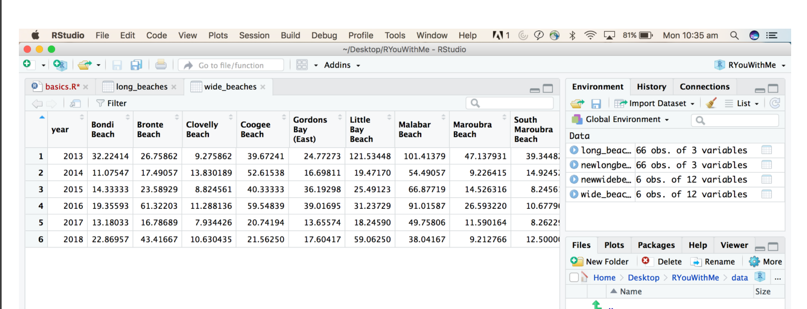
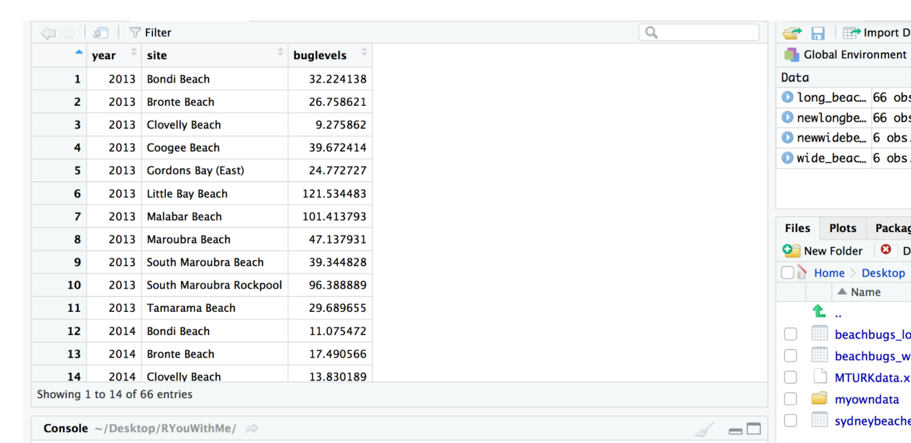

```{r setup, include=FALSE}
knitr::opts_chunk$set(echo = TRUE)
```
## INTRODUCTION

this is the rmd i'm creating as i'm going through the clean it up # 5 tutorial from ryouwithme

here is the [link to tutorial](https://rladiessydney.org/courses/ryouwithme/02-cleanitup-5/)

reshaping data from wide to long and long to wide is sometimes necessary. for most projects to work with r functions your data needs to be in long format. 

p.s. i'm also using this to continue practicing and learning git/github


## Wide vs. Long Format

wide format data has individual observational units (e.g. people, beaches) spread across many columns. it look like this

long format data puts those individual observational units in a single column and look like this: 

```{r}
library(tidyverse)
library(here)
```

```{r}
wide_data <-   read.csv(here("Data", "beaches_wide.csv"))
```

```{r}
#pivot wide data to long
beaches_long <- wide_data %>% 
  pivot_longer(names_to = "site",
               values_to = "buglevels",
               `Bondi.Beach`: `Tamarama.Beach`)
```

